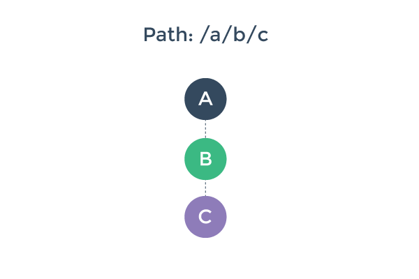
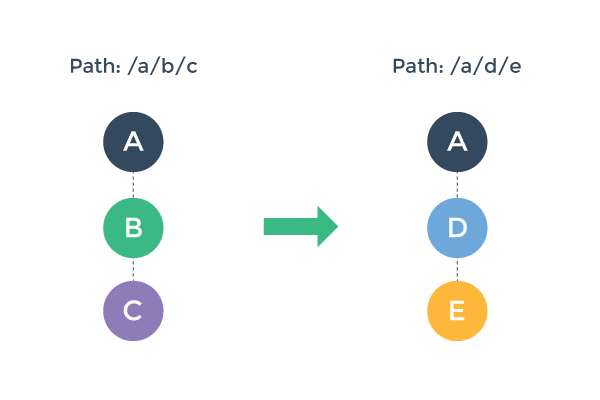

# vue-router文档
---

# 安装

### 直接下载

查看 [dist 目录](https://github.com/vuejs/vue-router/tree/dev/dist). 注意，dist 目录下的文件是最新稳定版，不会同步更新到 `dev` 分支上的最新代码

### CDN
[jsdelivr](https://cdn.jsdelivr.net/vue.router/0.7.10/vue-router.min.js)

[cdnjs](https://cdnjs.cloudflare.com/ajax/libs/vue-router/0.7.10/vue-router.min.js)

### NPM

``` bash
npm install vue-router
```

如果使用 CommonJS 模块规范, 需要显式的使用 `Vue.use()` 安装路由模块：

``` js
var Vue = require('vue')
var VueRouter = require('vue-router')

Vue.use(VueRouter)
```

使用独立编译文件是不需要这样做，因为路由模块会自动安装。

### Dev Build

如果想要使用最新的 dev 版本，需要直接从 GitHub clone 然后自己构建。

``` bash
git clone https://github.com/vuejs/vue-router.git node_modules/vue-router
cd node_modules/vue-router
npm install
npm run build
```

### Bower

``` bash
bower install vue-router
```
# 基本用法

使用 Vue.js 和 vue-router 创建单页应用非常的简单，使用 Vue.js 开发，整个应用已经被拆分成了独立的组件。在使用 vue-router 时，我们需要做的就是把路由映射到各个组件，vue-router 会把各个组件渲染到正确的地方。下面是个简单的例子：

### HTML

``` html
<div id="app">
  <h1>Hello App!</h1>
  <p>
    <!-- 使用指令 v-link 进行导航。 -->
    <a v-link="{ path: '/foo' }">Go to Foo</a>
    <a v-link="{ path: '/bar' }">Go to Bar</a>
  </p>
  <!-- 路由外链 -->
  <router-view></router-view>
</div>
```

### JavaScript

``` js
// 定义组件
var Foo = {
    template: '<p>This is foo!</p>'
}

var Bar = {
    template: '<p>This is bar!</p>'
}

// 路由器需要一个根组件。
// 出于演示的目的，这里使用一个空的组件，直接使用 HTML 作为应用的模板
var App = {}

// 创建一个路由器实例
// 创建实例时可以传入配置参数进行定制，为保持简单，这里使用默认配置
var router = new VueRouter()

// 定义路由规则
// 每条路由规则应该映射到一个组件。这里的“组件”可以是一个使用 Vue.extend
// 创建的组件构造函数，也可以是一个组件选项对象。
// 稍后我们会讲解嵌套路由
router.map({
    '/foo': {
        component: Foo
    },
    '/bar': {
        component: Bar
    }
})

// 现在我们可以启动应用了！
// 路由器会创建一个 App 实例，并且挂载到选择符 #app 匹配的元素上。
router.start(App, '#app')
```

查看示例应用 [在线](http://jsfiddle.net/yyx990803/xyu276sa/).
# 嵌套路由

嵌套路由和嵌套组件之间的匹配是个很常见的需求，使用 vue-router 可以很简单的完成这点。

假设我们有如下一个应用：

``` html
<div id="app">
  <router-view></router-view>
</div>
```

`<router-view>` 是一个顶级的外链。它会渲染一个和顶级路由匹配的组件：

``` js
router.map({
  '/foo': {
    // 路由匹配到/foo时，会渲染一个Foo组件
    component: Foo
  }
})
```

同样的，组件内部也可以包含自己的外链，嵌套的 `<router-view>` 。例如，如果我们在组件 `Foo` 的模板中添加了一个：

``` js
var Foo = {
  template:
    '<div class="foo">' +
      '<h2>This is Foo!</h2>' +
      '<router-view></router-view>' + // <- 嵌套的外链
    '</div>'
}
```

为了能够在这个嵌套的外链中渲染相应的组件，我们需要更新我们的路由配置：

``` js
router.map({
  '/foo': {
    component: Foo,
    // 在/foo下设置一个子路由
    subRoutes: {
      '/bar': {
        // 当匹配到/foo/bar时，会在Foo's <router-view>内渲染
        // 一个Bar组件
        component: Bar
      },
      '/baz': {
        // Baz也是一样，不同之处是匹配的路由会是/foo/baz
        component: Baz
      }
    }
  }
})
```

使用以上的配置，当访问 `/foo` 时，`Foo` 的外链中不会渲染任何东西，因为配置中没有任何子路由匹配这个地址。或许你会想渲染一些内容，此时你可以设置一个子路由匹配 `/` ：

``` js
router.map({
  '/foo': {
    component: Foo,
    subRoutes: {
      '/': {
        // 当匹配到 /foo 时，这个组件会被渲染到 Foo 组件的 <router-view> 中。
        // 为了简便，这里使用了一个组件的定义
        component: {
          template: '<p>Default sub view for Foo</p>'
        }
      },
      // 其他子路由
    }
  }
})
```

查看对应的实例 [在线](http://jsfiddle.net/yyx990803/naeg67da/).
# 路由规则和路由匹配

Vue-router 做路径匹配时支持动态片段、全匹配片段以及查询参数（片段指的是 URL 中的一部分）。对于解析过的路由，这些信息都可以通过**路由上下文对象**（从现在起，我们会称其为路由对象）访问。
在使用了 vue-router 的应用中，路由对象会被注入每个组件中，赋值为 `this.$route` ，并且当路由切换时，路由对象会被更新。

路由对象暴露了以下属性：

- **$route.path**

  字符串，等于当前路由对象的路径，会被解析为绝对路径，如 `"/foo/bar"` 。

- **$route.params**

  对象，包含路由中的动态片段和全匹配片段的键值对，详情见后文

- **$route.query**

  对象，包含路由中查询参数的键值对。例如，对于 `/foo?user=1` ，会得到 `$route.query.user == 1` 。

- **$route.router**

  路由规则所属的路由器（以及其所属的组件）。

- **$route.matched**

  数组，包含当前匹配的路径中所包含的所有片段所对应的配置参数对象。

- **$route.name**

  当前路径的名字。 (参见[具名路径](./named.md))

### 自定义字段

除了以上这些内置的属性外，在路由设置对象中的其他自定义字段也会被拷贝到最终的路由对象上。例如：

``` js
router.map({
  '/a': {
    component: { ... },
    auth: true // 这里 auth 是一个自定义字段
  }
})
```

当 `/a` 被匹配时，`$route.auth` 的值将会是 `true`。我们可以利用这个特性在全局的钩子函数中进行身份验证：

``` js
router.beforeEach(function (transition) {
  if (transition.to.auth) {
    // 对用户身份进行验证...
  }
})
```

当嵌套的路径被匹配时，每一个路径段的自定义字段都会被拷贝到同一个路由对象上。如果一个子路径和一个父路径有相同的字段，则子路径的值会覆盖父路径的值。

### 在模板中使用

你可以直接在组件模板中使用 `$route` 。例如：

``` html
<div>
  <p>当前路径: {{$route.path}}</p>
  <p>当前路由参数: {{$route.params | json}}</p>
</div>
```

### 路由匹配

#### 动态片段

动态片段使用以冒号开头的路径片段定义，例如 `user/:username` 中，`:username` 就是动态片段。它会匹配注入 `/user/foo` 或者 `/user/bar` 之类的路径。当路径匹配一个含有动态片段的路由规则时，动态片段的信息可以从 `$route.params` 中获得。

使用示例：

``` js
router.map({
  '/user/:username': {
    component: {
      template: '<p>用户名是{{$route.params.username}}</p>'
    }
  }
})
```

一条路径中可以包含多个动态片段，每个片段都会被解析成 `$route.params` 的一个键值对。

例子:

| 模式 | 匹配的路径 | $route.params |
|---------|------|--------|
| /user/:username | /user/evan | `{ username: 'evan' }` |
| /user/:username/post/:post_id | /user/evan/post/123 | `{ username: 'evan', post_id: 123 }` |

#### 全匹配片段

动态片段只能匹配路径中的一个部分，而全匹配片段则基本类似于它的贪心版。例如 `/foo/*bar` 会匹配任何以 `/foo/` 开头的路径。匹配的部分也会被解析为 `$route.params` 中的一个键值对。

例如:

| 模式 | 匹配的路径 | $route.params |
|---------|------|--------|
| /user/*any | /user/a/b/c | `{ any: 'a/b/c' }` |
| /foo/*any/bar | /foo/a/b/bar | `{ any: 'a/b' }` |
# 具名路径

在有些情况下，给一条路径加上一个名字能够让我们更方便地进行路径的跳转。你可以按照下面的示例给一条路径加上名字：

``` js
router.map({
  '/user/:userId': {
    name: 'user', // 给这条路径加上一个名字
    component: { ... }
  }
})
```

可以如下用 `v-link` 链接到该路径：

``` html
<a v-link="{ name: 'user', params: { userId: 123 }}">User</a>
```

同样，也可以用 `router.go()` 来切换到该路径：

``` js
router.go({ name: 'user', params: { userId: 123 }})
```

以上两种情况，路由都会最终切换到 `/user/123`。
# 路由选项

当创建路由器实例时，可以使用以下参数自定义路由器的行为。

#### hashbang

- 默认值： true
- 只在 hash 模式下可用

  当 hashbang 值为 true 时，所有的路径都会被格式化为以 `#!` 开头。例如 `router.go('/foo/bar')` 会把浏览器的 URL 设为 `example.com/#!/foo/bar` 。

#### history

- 默认值： false

  启用 HTML5 history 模式。利用 `history.pushState()` 和 `history.replaceState()` 来管理浏览历史记录。

  **注意**： 当使用 HTML5 history 模式时，服务器需要被[正确配置](http://readystate4.com/2012/05/17/nginx-and-apache-rewrite-to-support-html5-pushstate/) 以防用户在直接访问链接时会遇到404页面。

####  abstract

- 默认值： false

  使用一个不依赖于浏览器的浏览历史虚拟管理后端。虚拟模式在测试或者实际的 URL 并不重要时，非常有用。例如 Electron 或者 Cordova 应用。在非浏览器模式下，路由器同样会退化为抽象模式。

#### root

- 默认值： null
- 只在 HTML5 history 模式下可用

  定义路由根路径。在 `router.go()` 、`v-link` 以及在路由对象中配置的所有路径都会解析为此根路径的相对路径，根路径总是会出现在浏览器地址栏的 URL 中。

  例如，对于 `root: '/foo'` ，`v-link="/bar"` 会把浏览器 URL 设置为 `/foo/bar` 。直接访问 `/foo/bar` 会匹配路由配置中的 `/bar` 。

  多数情况下，在应用中并不需要关心 `root` 。

#### linkActiveClass

- 默认值： `"v-link-active"`

  配置当 `v-link` 元素匹配的路径时需要添加到元素上的 class 。只要当前路径以 `v-link` 的 URL 开头，这个 class 就会被添加到这个元素上。活跃匹配的规则和添加的 class 也可以通过 `v-link` 的内联选项单独指定。

#### saveScrollPosition

- 默认值： false
- 只在 HTML5 history 模式下可用

  当用户点击后退按钮时，借助 HTML5 history 中的 `popstate` 事件对应的 state 来重置页面的滚动位置。注意，当 `<router-view>` 设定了相应的场景切换效果时，这个可能不会得到预想的效果。

#### transitionOnLoad

- 默认值： false

  在初次加载时是否对 `<router-view>` 处理场景切换效果。默认情况下，组件在初次加载时会直接渲染。

#### suppressTransitionError

- 默认值： false

  当值为 `true` 时，在场景切换钩子函数中发生的异常会被吞掉。
# `<router-view>`

`<router-view>` 用于渲染匹配的组件，它基于 Vue 的动态组件系统，所以它继承了一个正常动态组件的很多特性。

- 你可以传递 props。
- `<router-view>` 中的 HTML 内容会被插入到相应组件的内容插入点（由 content 指定）。
- `transition` 和 `transition-mode` 的完整支持。注意：为了场景切换效果能正常工作，路由组件必须不是一个[片断实例](http://vuejs.org/guide/components.html#Fragment_Instance)。
- `v-ref` 也得到支持；被渲染的组件会注册到父级组件的 `this.$` 对象。

然而，它也有一些限制

- ~~`keep-alive` 不支持。~~ `keep-alive` 目前在 0.7.2+ 已经可用。
- `wait-for` 也不支持。你应该使用[切换钩子函数 `activate` ](pipeline/activate.html)控制切换的时机。
# v-link

`v-link` 是一个用来让用户在 vue-router 应用的不同路径间跳转的指令。该指令接受一个 JavaScript 表达式，并会在用户点击元素时用该表达式的值去调用 `router.go`。

``` html
<!-- 字面量路径 -->
<a v-link="'home'">Home</a>

<!-- 效果同上 -->
<a v-link="{ path: 'home' }">Home</a>

<!-- 具名路径 -->
<a v-link="{ name: 'user', params: { userId: 123 }}">User</a>
```

你应该使用 `v-link` 而不是 `href` 来处理浏览时的跳转。原因如下：

- 它在 HTML5 history 模式和 hash 模式下的工作方式相同，所以如果你决定改变模式，或者 IE9 浏览器退化为 hash 模式时，都不需要做任何改变。

- 在 HTML5 history 模式下，`v-link` 会监听点击事件，防止浏览器尝试重新加载页面。

- 在 HTML5 history 模式下使用 `root` 选项时，不需要在 `v-link` 的 URL 中包含 root 路径。

#### 链接活跃时的 class

带有 `v-link` 指令的元素，如果 `v-link` 对应的 URL 匹配当前的路径，该元素会被添加特定的 class。默认添加的 class 是 `.v-link-active`，而判断是否活跃使用的是**包含性匹配**。举例来说，一个带有指令 `v-link="/a"` 的元素，只要当前路径以 `/a` 开头，此元素即会被判断为活跃。

连接是否活跃的匹配也可以通过 `exact` 内联选项来设置为只有当路径完全一致时才匹配：

``` html
<a v-link="{ path: '/a', exact: true }"></a>
```

链接活跃时的 class 名称可以通过在创建路由器实例时指定 `linkActiveClass` 全局选项 来自定义，也可以通过 `activeClass` 内联选项来单独指定：

``` html
<a v-link="{ path: '/a', activeClass: 'custom-active-class' }"></a>
```

#### 其他选项

- **replace**

  一个带有 `replace: true` 的链接被点击时将会触发 `router.replace()` 而不是 `router.go()`。由此产生的跳转不会留下历史记录：

  ``` html
  <a v-link="{ path: '/abc', replace: true }"></a>
  ```

- **append**

  带有 `append: true` 选项的相对路径链接会确保该相对路径始终添加到当前路径之后。举例来说，从 `/a` 跳转到相对路径 `b` 时，如果没有 `append: true` 我们会跳转到 `/b`，但有 `append: true` 则会跳转到 `/a/b`。

  ``` html
  <a v-link="{ path: 'relative/path', append: true }"></a>
  ```

#### 其他注意点

- `v-link` 会自动设置 `<a>` 的 `href` 属性。

- 根据[Vue.js 1.0 binding syntax](https://github.com/vuejs/vue/issues/1325)， `v-link` 不再支持包含 mustache 标签。可以用常规的JavaScript表达式代替 mustache 标签， 例如 `v-link="'user/' + user.name"` 。
# 动态组件载入 lazy load

当你在使用 Webpack 或者 Browserify 时，在基于[异步组件](http://vuejs.org/guide/components.html#Async_Components)编写的 Vue 项目时，也可以较为容易的实现惰性加载组件。不再是之前所述的直接引用一个组件，现在需要像下面这样通过定义一个函数返回一个组件：


``` js
router.map({
  '/async': {
    component: function (resolve) {
      // somehow retrieve your component definition from server...
      resolve(MyComponent)
    }
  }
})
```

现在，通过手动实现组件的加载不是个理想的办法，不过像 Webpack 和 Browserify 这类的构建工具都提供了一些更加简单方便的解决方案。

### Webpack

Webpack 已经集成了代码分割功能。你可以使用 AMD 风格的 `require` 来对你的代码标识代码分割点:

``` js
require(['./MyComponent.vue'], function (MyComponent) {
  // code here runs after MyComponent.vue is asynchronously loaded.
})
```

和路由配合使用，如下：

``` js
router.map({
  '/async': {
    component: function (resolve) {
      require(['./MyComponent.vue'], resolve)
    }
  }
})
```

现在，只有当 `/async` 需要被渲染时，`MyComponent.vue`组件，会自动加载它的依赖组件，并且异步的加载进来。

### Browserify

使用 Browserify 还需要一些技巧。你可能需要插件 [`partition-bundle`](https://github.com/substack/browserify-handbook/blob/master/readme.markdown#partition-bundle)，并且需要在 `json` 文件中手动声明：

``` json
{
  "main.js": ["./main.js"],
  "my-component.js": ["./MyComponent.vue"]
}
```

然后在 `main.js`，你需要做一些类似的操作，用 `loadjs` 替代 `require`：

``` js
router.map({
  '/async': {
    component: function (resolve) {
      loadjs(['./MyComponent.vue'], resolve)
    }
  }
})
```
# 切换控制流水线

为更好的理解路由切换的管道，假设我们一个启用了路由的应用，此应用在路径 `/a/b/c` 时渲染了三个嵌套的 `<router-view>` :



接着，用户浏览新路径 `/a/d/e` ，导致需要更新，渲染一个新的组件树：



如何做到这些呢？这个过程包含一些我们必须要做的工作：

1. 可以重用组件 A ，因为重新渲染后，组件 A 依然保持不变。

2. 需要停用并移除组件 B 和 C 。

3. 启用并激活组件 D 和 E 。

4. 在执行步骤2和3之前，需要确保切换效果有效 - 也就是说，为保证切换中涉及的所有组件都**能**按照期望的那样被停用/激活。

使用 vue-router ，你可以控制通过实现切换钩子函数来控制这些步骤。但是在了解如何做的细节之前，我们先了解一下大局。

### 切换的各个阶段

我们可以把路由切换分为三个阶段：

1. **可重用阶段：**

  检查当前的视图结构中是否存在可以重用的组件。这是通过对比两个新的组件树，找出共用的组件，然后检查它们的可重用性（通过 `canReuse` 选项）。默认情况下， 所有组件都是可重用的，除非是定制过。

  

2. **验证阶段：**

  检查当前的组件是否能够停用以及新组件是否可以被激活。这是通过调用路由配置阶段的 `canDeactivate` 和 `canActivate` 钩子函数来判断的。

  

  注意，`canDeactivate` 按照从下至上的冒泡顺序检查，而 `canActivate` 则是从上之下。

  任何一个钩子函数都可以终止界面切换。如果在验证阶段终止了界面切换，路由器会保持当前的应用状态，恢复到前一个路径。

3. **激活阶段：**

  一旦所有的验证钩子函数都被调用而且没有终止切换，切换就可以认定是合法的。路由器则开始禁用当前组件并启用新组件。

  

  此阶段对应钩子函数的调用顺序和验证阶段相同，其目的是在组件切换真正执行之前提供一个进行清理和准备的机会。界面的更新会等到所有受影响组件的 `deactivate` 和 `activate` 钩子函数执行之后才进行。

  `data` 这个钩子函数会在 `activate` 之后被调用，或者当前组件组件可以重用时也会被调用。

接下来我们会谈论一下切换过程中各个钩子函数的细节。
# 切换过程中的钩子

在切换过程中，`<router-view>` 组件可以通过实现一些钩子函数来控制切换过程。这些钩子函数包括：

- `data`
- `activate`
- `deactivate`
- `canActivate`
- `canDeactivate`
- `canReuse`

你可以在组件的 `route` 选项中实现这些函数。

``` js
Vue.component('hook-example', {
  // ... other options
  route: {
    activate: function (transition) {
      console.log('hook-example activated!')
      transition.next()
    },
    deactivate: function (transition) {
      console.log('hook-example deactivated!')
      transition.next()
    }
  }
})
```

### 切换对象

每个切换钩子函数都会接受一个 `transition` 对象作为参数。这个切换对象包含以下函数和方法：

- **transition.to**

  一个代表将要切换到的路径的[路由对象](../route.md)。

- **transition.from**

  一个代表当前路径的路由对象。

- **transition.next()**

  调用此函数处理切换过程的下一步。

- **transition.abort([reason])**

  调用此函数来终止或者拒绝此次切换。

- **transition.redirect(path)**

  取消当前切换并重定向到另一个路由。

### 钩子函数异步 resolve 规则

我们经常需要在钩子函数中进行异步操作。在一个异步的钩子被 resolve 之前，切换会处于暂停状态。钩子的 resolve 遵循以下规则：

1. 如果钩子返回一个 Promise，则钩子何时 resolve 取决于该 Promise 何时 resolve。[更多细节](#%E5%9C%A8%E9%92%A9%E5%AD%90%E4%B8%AD%E8%BF%94%E5%9B%9E-promise)

2. 如果钩子既不返回 Promise，也没有任何参数，则该钩子将被同步 resolve。例如：

  ``` js
  route: {
    activate: function (/* 没有参数 */) {
      // 如果不返回 Promise，则同步 resolve
    }
  }
  ```

3. 如果钩子不返回 Promise，但是有一个参数 (`transition`)，则钩子会等到 `transition.next()`, `transition.abort()` 或是 `transition.redirect()` 之一被调用才 resolve。例如：

  ``` js
  route: {
    activate: function (transition) {
      // 一秒后 resolve
      setTimeout(transition.next, 1000)
    }
  }
  ```

4. 在验证类的钩子，比如 `canActivate`, `canDeactivate` 以及[全局 beforeEach 钩子](../api/before-each.md) 中，如果返回值是一个布尔值 (Boolean)，也会使得钩子同步 resolve。

### 在钩子中返回 Promise

- 当在钩子函数中返回一个 Promise 时，系统会在该 Promise 被 resolve 之后自动调用`transition.next`。

- 如果 Promise 在验证阶段被 reject，系统会调用 `transition.abort`。

- 如果 Promise 在激活阶段被 reject，系统会调用 `transition.next` 。

- 对于验证类钩子（ `canActivate` 和 `canDeactivate` ），如果 Promise resolve 之后的值是假值（ falsy value ），系统会中断此次切换。

- 如果一个被 reject 的 Promise 抛出了未捕获的异常，这个异常会继续向上抛出，除非在创建路由器的时候启用了参数 `suppressTransitionError` 。

**例子：**

``` js
// 在组件定义内部
route: {
  canActivate: function () {
    // 假设此 service 返回一个 Promise ，这个 Promise 被断定后
    // 的值是 `true` 或者 `false`
    return authenticationService.isLoggedIn()
  },
  activate: function (transition) {
    return messageService
      .fetch(transition.to.params.messageId)
      .then((message) => {
        // 获取数据后更新 data
        // 组件知道此函数执行过后才会被展示出来
        this.message = message
      })
  }
}
```

此处，我们在 `activate` 钩子中异步的获取数据，因为这里仅仅是做个示例；注意通常我们可以使用[ `data` 钩子](data.md)来做这些，它会更加适合。

**提示：** 如果使用 ES6 ，可以使用参数解构（ argument destructuring ）使钩子更加简洁：

``` js
route: {
  activate ({ next }) {
    // when done:
    next()
  }
}
```

查看 vue-router 中的[高级示例](https://github.com/vuejs/vue-router/tree/dev/example/advanced)

### 钩子合并

和组件本身的生命周期钩子一样，以下路由生命周期钩子：

- `data`
- `activate`
- `deactivate`

也会在合并选项时（扩展类或是使用 mixins）被合并。举例来说，如果你的组件本身定义了一个路由 `data` 钩子，而这个组件所调用的一个 mixin 也定义了一个路由 `data` 钩子，则这两个钩子都会被调用，并且各自返回的数据将会被最终合并到一起。

需要注意的是，验证类钩子，比如 `canActivate`, `canDeactivate` 和 `canReuse` 在合并选项时会直接被新值覆盖。
# `data(transition) [-> Promise]`

在激活阶段被调用，在 `activate` 被断定（ resolved ，指该函数返回的 promise 被 resolve ）。用于加载和设置当前组件的数据。

### 参数

- [`transition {Transition}`](hooks.md#transition-object)

  调用 `transition.next(data)` 会为组件的 `data` 相应属性赋值。例如，使用 `{ a: 1, b: 2 }` ，路由会调用 `component.$set('a', 1)` 以及 `component.$set('b', 2)` 。

### 预期返回值

- 可选择性返回一个Promise
  - `resolve(data)` -> `transition.next(data)`
  - `reject(reason)` -> `transition.abort(reason)`


- 或者，返回一个包含 Promise 的对象。见后文 [Promise 语法糖](#promise-%E8%AF%AD%E6%B3%95%E7%B3%96)

### 详情

`data` 切换钩子会在 `activate` 被断定（ resolved ）以及界面切换之前被调用。切换进来的组件会得到一个名为 **`$loadingRouteData`** 的元属性，其初始值为 `true` ，在 `data` 钩子函数被断定后会被赋值为 `false` 。这个属性可用来会切换进来的组件展示加载效果。

`data` 钩子和 `activate` 钩子的不同之处在于：

1. `data`在每次路由变动时都会被调用，即使是当前组件可以被重用的时候，但是 `activate` 仅在组件是新创建时才会被调用。

  假设我们有一个组件对应于路由 `/message/:id` ，当前用户所处的路径是 `/message/1` 。当用户浏览 `/message/2` 时，当前组件可以被重用，所以 `activate` 不会被调用。但是我们需要根据新的 `id` 参数去获取和更新数据，所以大部分情况下，在 `data` 中获取数据比在 `activate` 中更加合理。

2. `activate` 的作用是控制切换到新组件的时机。`data` 切换钩子会在 `activate` 被断定（ resolved ）以及界面切换之前被调用，所以数据获取和新组件的切入动画是并行进行的，而且在 `data` 被断定（ resolved ）之前，组件会处在“加载”状态。

  从用户体验的角度来看一下两者的区别：

  - 如果我们等到获取到数据之后再显示新组件，用户会感觉在切换前界面被卡住了。

  - 相反的话（指不用等到获取数据后再显示组件），我们立刻响应用户的操作，切换视图，展示新组件的“加载”状态。如果我们在 CSS 中定义好相应的效果，这正好可以用来掩饰数据加载的时间。

这么说的话，如果你想等到数据获取之后再切换视图，可以在组件定义路由选项时，添加 **`waitForData: true`** 参数。

### 例子

调用 `transition.next` ：

``` js
route: {
  data: function (transition) {
    setTimeout(function () {
      transition.next({
        message: 'data fetched!'
      })
    }, 1000)
  }
}
```

返回 Promise ：

``` js
route: {
  data: function (transition) {
    return messageService
      .fetch(transition.to.params.messageId)
      .then(function (message) {
        return { message: message }
      })
  }
}
```

并发请求，利用 Promise & ES6 :

``` js
route: {
  data ({ to: { params: { userId }}}) {
    return Promise.all([
      userService.get(userId),
      postsService.getForUser(userId)
    ]).then(([user, post]) => ({ user, post }))
  }
}
```

与上面等价的 ES5 版本：

``` js
route: {
  data (transition) {
    var userId = transition.to.params.userId
    return Promise.all([
      userService.get(userId),
      postsService.getForUser(userId)
    ]).then(function (data) {
      return {
        user: data[0],
        posts: data[1]
      }
    })
  }
}
```

在模板中使用 `$loadingRouteData` ：

``` html
<div class="view">
  <div v-if="$loadingRouteData">Loading ...</div>
  <div v-if="!$loadingRouteData">
    <user-profile user="{{user}}"></user-profile>
    <user-post v-for="post in posts"></user-post>
  </div>
</div>
```

### Promise 语法糖

上面的并发请求示例需要我们自己调用 `Promise.all` 来将多个 Promise 合并成一个，并且最终处理返回的数据时也有些繁琐。`vue-router` 在这里提供了一个语法糖，让我们可以在 `data` 函数中直接返回一个包含 Promise 的对象（当然也可以包含非 Promise 的值）。利用这个语法糖和 ES6，我们可以这样实现上面的例子：

``` js
route: {
  data: ({ to: { params: { userId }}}) => ({
    user: userService.get(userId),
    post: postsService.getForUser(userId)
  })
}
```

路由器将会在这两个 Promise resolve 之后的值分别赋值给组件的 `user` 和 `post` 属性。同时，`$loadingRouteData` 会在所有的 Promise 都 resolve 之后被设置为 `false`。

上面的例子在 ES5 下可以这样写:

``` js
route: {
  data: function (transition) {
    var userId = transition.to.params.userId
    return {
      user: userService.get(userId),
      post: postsService.getForUser(userId)
    }
  }
}
```
# `activate(transition) [-> Promise]`

在激活阶段，当组件被创建而且将要切换进入的时候被调用。

### 参数

- [`transition {Transition}`](hooks.md#transition-object)

  调用 `transition.next()` 可以断定（ resolve ）这个钩子函数。注意，这里调用 `transition.abort()` 并不会把应用回退到前一个路由状态因为此时切换已经被确认合法了。

### 预期返回值

- 可选择性返回 Promise。
  - `resolve` -> `transition.next()`
  - `reject(reason)` -> `transition.abort(reason)`

### 详情

多数时候，这个函数用于控制视图转换的时机，因为视图切换会在这个函数被断定（ resolved ）之后开始。

这个钩子会从上至下进行调用。子组件视图的 `activate` 只会在父级组件视图 `activate` 被断定（ resolved ）之后执行。
# `deactivate(transition) [-> Promise]`

在激活阶段，当一个组件将要被禁用和移除之时被调用。

### 参数

- [`transition {Transition}`](hooks.md#transition-object)

  调用 `transition.next()` 可以断定（ resolve ）这个钩子函数。注意，这里调用 `transition.abort()` 并不会把应用回退到前一个路由状态因为此时切换已经被确认合法了。

### 预期返回值

- 可选择性返回 Promise
  - `resolve` -> `transition.next()`
  - `reject(reason)` -> `transition.abort(reason)`

### 详情

此钩子函数的调用顺序从下至上。父级组件的 `deactivate` 会在子级组件的 `deactivate` 被断定（ resolved ）之后被调用。

新组件的 `activate` 钩子函数会在所有组件的 `deactivate` 钩子函数被断定（ resolved ）之后被调用。
# `canActivate(transition) [-> Promise | Boolean]`

在验证阶段，当一个组件将要被切入的时候被调用。

### 参数

- [`transition {Transition}`](hooks.md#transition-object)

  调用 `transition.next()` 可以断定（ resolve ）此钩子函数。调用 `transition.abort()` 可以无效化并取消此次切换。

### 预期返回值

- 可选择性返回 Promise :

  - `resolve(true)` -> `transition.next()`
  - `resolve(false)` -> `transition.abort()`
  - `reject(reason)` -> `transition.abort(reason)`


- 可选择性返回 Boolean 值：

  - `true` -> `transition.next()`
  - `false` -> `transition.abort()`

### 详情

此钩子函数的调用顺序是从上之下。子级组件视图的 `canActivate` 钩子仅在父级组件的 `canActivate` 被断定（ resolved ）之后调用。
# `canDeactivate(transition) [-> Promise | Boolean]`

在验证阶段，当一个组件将要被切出的时候被调用。

### 参数

- [`transition {Transition}`](hooks.md#transition-object)

  调用 `transition.next()` 可以断定（ resolve ）此钩子函数。调用 `transition.abort()` 可以无效化并取消此次切换。

### 预期返回值

- 可选择性返回 Promise :

  - `resolve(true)` -> `transition.next()`
  - `resolve(false)` -> `transition.abort()`
  - `reject(reason)` -> `transition.abort(reason)`


- 可选择性返回 Boolean 值:

  - `true` -> `transition.next()`
  - `false` -> `transition.abort()`

### 详情

此钩子函数的调用顺序是从下至上。组件的 `canDeactivate` 钩子仅在子级组件的 `canDeactivate` 被断定（ resolved ）之后调用。
# `canReuse: Boolean | canReuse(transition) -> Boolean`

决定组件是否可以被重用。如果一个组件不可以重用，当前实例会被一个新的实例替换，这个新实例会经历正常的验证和激活阶段。

此路由配置参数可以是一个 Boolean 值或者一个返回同步的返回 Boolean 值的函数。**默认值为 `true` **.

### 参数

- [`transition {Transition}`](hooks.md#transition-object)

  在 `canReuse` 钩子中只能访问 `transition.to` 和 `transition.from` 。

### 预期返回值

- 必须返回 Boolean 类型，其他等效的假值（ Falsy values ）会当作 `false` 对待。

### 详情

`canReuse` 会同步调用，而且从上至下对所有可能重用的组件都会调用。

如果组件可以重用，它的 `data` 钩子在激活阶段仍然会被调用。
# API 索引

- [路由器实例属性](properties.md)
- [router.start](start.md)
- [router.stop](stop.md)
- [router.map](map.md)
- [router.on](on.md)
- [router.go](go.md)
- [router.replace](replace.md)
- [router.redirect](redirect.md)
- [router.alias](alias.md)
- [router.beforeEach](before-each.md)
- [router.afterEach](after-each.md)
# 路由器实例属性

> 这里只列出了公开属性

### `router.app`

- 类型: `Vue`

  此路由器管理的根 Vue 实例。这个实例是由调用 `router.start()` 传入的 Vue 组件构造器函数创建的。

### `router.mode`

- 类型: `String`

  `html5`、`hash` 或者 `abstract`。

  - **`html5`**: 使用 HTML5 history API ，监听 `popstate` 事件。支持 [`saveScrollPosition`](../options.html#savescrollposition) .

  - **`hash`**: 使用 `location.hash` ，监听 `hashchange` 事件。如果创建路由器时声明 `history: true` ，则在不支持 history 模式的路由器下会退化为 hash 模式。

  - **`abstract`**: 不监听任何事件。如果没有 `window` 对象（例如非浏览器环境），则会自动退化到此模式。
# `router.start(App, el)`

启动一个启用了路由的应用。创建一个 `App` 的实例并且挂载到元素 `el` 。

### 参数

- `App: Function | Object`

  `App` 可以是 Vue 组件构造函数或者一个组件选项对象。如果是一个对象，路由会隐式的对其调用 `Vue.extend` 。这个组件会用来创建这个应用的根组件。

- `el: String | Element`

  挂载应用的元素。可以是 CSS 选择符或者一个实际的元素。
# `router.stop()`

停止监听 `popstate` 和 `hashchange` 事件。

注意，当路由处于停止状态，`router.app` 并没有销毁，你依然可以使用 `router.go(path)` 进行跳转。你也可以不使用参数调用 `router.start()` 来重新启动路由。
# `router.map(routeMap)`

定义路由映射的主要方法。

### 参数

- `routeMap: Object`

  结构体，键为路径，值为路由配置对象。对于路径匹配规则，查看[路由匹配](../route.html#route-matching).

### 路由配置对象

路由配置对象包含两个字段：

- `component`: 当路径匹配时，会渲染到顶级 `<router-view>` 的 Vue 组件。此字段的值可以是调用 `Vue.extend` 后返回的构造函数，或者普通的组件选项对象。在后一种情况下，路由会隐式调用 `Vue.extend` 。

- `subRoutes`: 嵌套的子路由映射。对于每一个 `subRoutes` 映射中的子路由对象，路由器在做匹配时会使用其路径拼接到父级路径后得到的全路径。成功匹配的组件会渲染到父级组件的 `<router-view>` 中。

### 例子

``` js
router.map({
  // 组件构造函数
  '/a': {
    component: Vue.extend({ /* ... */ })
  },
  // 组件选项对象
  '/b': {
    component: {
      template: '<p>Hello from /b</p>'
    }
  },
  // 嵌套的路由
  '/c': {
    component: {
      // 渲染子视图
      template: '<router-view></router-view>'
    },
    subRoutes: {
      // 当路径是 /c/d 时进行渲染
      '/d': { component: { template: 'D' }},
      // 当路径是 /c/e 时进行渲染
      '/e': { component: { template: 'E' }}
    }
  }
})
```
# `router.on(path, config)`

添加一条顶级的路由配置。在内部实现时，`router.map()` 对于接收到的路由映射对象中每个键值对都调用 `router.on()` 。

### 参数

- `path: String` - 查看[路由匹配](../route.md#route-matching)
- `config: Object` - 查看[路由配置对象](map.md#route-config-object).

### 例子

``` js
router.on('/user/:userId', {
  component: {
    template: '<div>{{$route.params.userId}}</div>'
  }
})
```
# `router.go(path)`

导航到一个新的路由

### 参数

- `path: String | Object`

  `path` 可以是一个字符串，或是包含跳转信息的对象。

  当是字符串时，该路径必须为一个普通路径（也就是说没有动态片段或者全匹配片段）。路径若不是以 `/` 开头的绝对路径，会以相对于当前路径的方式进行解析。

  当是对象时，可以是如下的格式：

  ``` js
  { path: '...' }
  ```

  或是：

  ``` js
  {
    name: '...',
    // params 和 query 可选
    params: { ... },
    query: { ... }
  }
  ```

  关于包含 `name` 的路径对象，参见[具名路径](../named.md).

  - 当用 `path` 格式跳转到一个相对路径时，可以用 `append: true` 选项来确保该相对路径始终被添加到当前路径之后。比如：

    - 从 `/a` 跳转到 `b` 时，若没有 `append: true`，则会跳转到 `b`;
    - 从 `/a` 跳转到 `b` 时，若有 `append: true`，则会跳转到 `/a/b`。

  - 两种格式都接受 `replace: true` 选项，使得该跳转不产生一个新的历史记录。
# `router.replace(path)`

和 `router.go(path)` 类似，但是并不会在浏览器历史创建一条新的纪录。

### 参数

- `path: String`

  此路径为一个普通路径（也就是说没有动态片段或者全匹配片段）。路径不能以 `/` 开头，会以相对于当前路径的方式进行解析。
# `router.redirect(redirectMap)`

为路由器定义全局的重定向规则。全局的重定向会在匹配当前路径之前执行。如果发现需要进行重定向，原本访问的路径会被直接忽略而且不会在浏览器历史中留下记录。

### 参数

- `redirectMap: Object`

  重定向映射对象的格式应该为 `{ fromPath: toPath, ... }` 。路径中可以包含动态片段。

### Example

``` js
router.redirect({

  // 重定向 /a 到 /b
  '/a': '/b',

  // 重定向可以包含动态片段
  // 而且重定向片段必须匹配
  '/user/:userId': '/profile/:userId',

  // 重定向任意未匹配路径到 /home
  '*': '/home'
})
```
# `router.alias(aliasMap)`

为路由器配置全局的别名规则。别名和重定向的区别在于，相对于重定向把 `fromPath` 替换为 `toPath` ，别名会保留 `fromPath` ，但是匹配时使用的是 `toPath` 。

例如，如果我们把 `/a` 取别名为 `/a/b/c` ，那么当我们访问 `/a` 时，浏览器地址栏中的URL会是 `/a` 。但是路由匹配是却像是在访问 `/a/b/c` 。

### 参数

- `aliasMap {Object}`

  别名映射对象的格式应该为 `{ fromPath: toPath, ... }` 。路径中可以包含动态片段。

### Example

``` js
router.alias({

  // 匹配 /a 时就像是匹配 /a/b/c
  '/a': '/a/b/c',

  // 别名可以包含动态片段
  // 而且重定向片段必须匹配
  '/user/:userId': '/user/profile/:userId'
})
```
# `router.beforeEach(hook)`

添加一个全局的前置钩子函数，这个函数会在路由切换开始时调用。调用发生在整个切换流水线之前。如果此钩子函数拒绝了切换，整个切换流水线根本就不会启动。

你可以注册多个全局的前置钩子函数。这些函数会按照注册的顺序被调用。调用是异步的，后一个函数会等待前一个函数完成后才会被调用。

### 参数

- `hook {Function}`

  此钩子函数一个类型为[切换对象](../pipeline/hooks.html#transition-object)的参数。

### Example

简单示例

``` js
router.beforeEach(function (transition) {
  if (transition.to.path === '/forbidden') {
    transition.abort()
  } else {
    transition.next()
  }
})
```

使用 Promise 和 ES6

``` js
router.beforeEach(function ({ to, next }) {
  if (to.path === '/auth-required') {
    // 返回一个断定会 true 或者 false 的 Promise
    return AuthService.isLoggedIn()
  } else {
    next()
  }
})
```
# `router.afterEach(hook)`

添加一个全局的后置钩子函数，该函数会在每次路由切换**成功进入激活阶段**时被调用。

注意，该函数调用时仅仅意味着切换已经被验证过了，也就是所有 `canDeactivate` 和 `canActivate` 钩子函数都成功的被断定( resolved )了，而且浏览器地址栏中的地址也已经更新。并不能保证所有的 `activate` 钩子函数都被断定了。

你可以注册多个全局的后置钩子函数，这些函数将会按照注册的顺序被同步调用。

### 参数

- `hook {Function}`

  此钩子函数一个类型为[切换对象](../pipeline/hooks.html#transition-object)的参数，但是你只能访问此参数的 `to` 和 `from` 属性, 这两个属性都是路由对象。在这个后置钩子函数里**不能**调用任何切换函数。

### Example

``` js
router.afterEach(function (transition) {
  console.log('成功浏览到: ' + transition.to.path)
})
```
