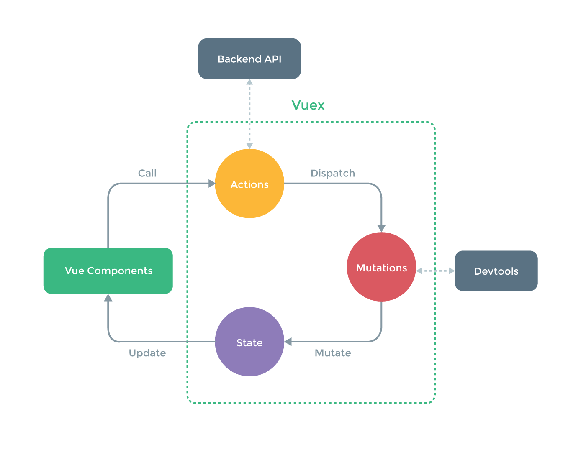

# 目录
---

## 什么是 Vuex?

Vuex 是一个专门为 Vue.js 应用所设计的集中式状态管理架构。它借鉴了 [Flux](https://facebook.github.io/flux/) 和 [Redux](https://github.com/rackt/redux) 的设计思想，但简化了概念，并且采用了一种为能更好发挥 Vue.js 数据响应机制而专门设计的实现。

## 我为什么需要它？

当你的应用还很简单的时候，你多半并不需要 Vuex。也不建议过早地使用 Vuex。但如果你正在构建一个中型以上规模的 SPA，你很有可能已经需要思考应该如何更好地归纳 Vue 之外，应用的其他组成部分。这就是 Vuex 要大显身手的时刻。

我们在单独使用 Vue.js 的时候，通常会把状态储存在组件的内部。也就是说，每一个组件都拥有当前应用状态的一部分，整个应用的状态是分散在各个角落的。然而我们经常会需要把状态的一部分共享给多个组件。一个常见的解决策略为：使用定制的事件系统，让一个组件把一些状态“*发送*”到其他组件中。这种模式的问题在于，大型组件树中的事件流会很快变得非常繁杂，并且调试时很难去找出究竟哪错了。

为了更好的解决在大型应用中状态的共用问题，我们需要对组件的 **组件本地状态**(component local state) 和 **应用层级状态**(application level state) 进行区分。应用级的状态不属于任何特定的组件，但每一个组件仍然可以监视(Observe)其变化从而响应式地更新 DOM。通过汇总应用的状态管理于一处，我们就不必到处传递事件。因为任何牵扯到一个以上组件的逻辑，都应该写在这里。此外，这样做也能让我们更容易地记录并观察状态的变更（Mutation，原意为突变），甚至可以实现出华丽如时光旅行一般的调试效果。（译注：是时候安利一波 [vue-devtools](https://github.com/vuejs/vue-devtools) 了）

Vuex 也对如何管理分撒各地的状态增加了一些约束，但仍保留有足够面对真实使用场景的灵活性。
# 准备开始

每一个 Vuex 应用的核心就是 **store**（仓库）。"store" 基本上就是一个容器，它包含着你应用里大部分的 **状态**(即 **state**). Vuex 和单纯的全局对象有以下两点不同：

1. Vuex 的状态存储是响应式的. 当 Vue 组件从 store 中读取状态的时候, 若 store 中的状态发生变化，那么相应的组件也会相应地高效地得到更新.

2. 你不能直接改变 store 中的状态。改变 store 中的状态的唯一途径就是显式地分发 **状态变更事件**(explicitly dispatching **mutations**)。这样使得我们可以方便地跟踪每一个状态的变化，从而让我们能够实现一些工具帮助我们更好地了解我们的应用。

### 最简单的 store

> **注意**：我们将会在后续的文档中用 ES2015 语法进行案例展示。如果你还没能掌握 ES2015，[你得抓紧了](https://babeljs.io/docs/learn-es2015/)！本文同样假设你已经了解了 Vue 本体的官方文档中[构建大型应用](http://vuejs.org.cn/guide/application.html)章节所涉及的概念.

创建 Vuex store 的过程相当直截了当 - 只要提供一个初始化的 state 对象，以及一些 mutations：

``` js
import Vuex from 'vuex'

const state = {
  count: 0
}

const mutations = {
  INCREMENT (state) {
    state.count++
  }
}

export default new Vuex.Store({
  state,
  mutations
})
```

现在，你可以通过 `store.state` 来读取 `state` 对象，还可以通过 dispatch 某 mutation 的名字来触发这些状态变更：

``` js
store.dispatch('INCREMENT')

console.log(store.state.count) // -> 1
```

如果你倾向于对象风格的分发方式，你可以用这种语法：

``` js
// 效果同上
store.dispatch({
  type: 'INCREMENT'
})
```

再次强调，我们通过分发 mutation 的方式，而非直接改变 `store.state.count`，是因为我们想要更明确地追踪到状态的变化。这个简单的约定能够让你的意图更加明显，这样你在阅读代码的时候能更容易地解读应用内部的状态改变。此外，这样也让我们有机会去实现一些能记录每次状态改变，保存状态快照的调试工具。有了它，我们甚至可以实现如时间穿梭般的调试体验。

以上只是一个用来展示 store 究竟是什么的一个极简例子。但是 Vuex 可不仅仅是状态存储。接下来，我们将会更深入地探讨一些核心概念：[State（状态）](state.md)，[Mutations（变更）](mutations.md) 和 [Actions（动作）](actions.md)。
# 简易教程

让我们通过一个简单的实际例子来理解怎样使用 Vuex。这个例子里，我们要实现一个按钮，每点击它一次，计数器加一。


我们会通过这个例子解释相应的概念，以及 Vuex 所要解决的问题：如何管理一个包含许多组件的大型应用。我们假定这个例子使用以下三个组件：

### `components/App.vue`

根组件，它包含了两个另外的子组件：

* `Display` 显示当前计数器的值
* `Increment` 使计数器加一的按钮

```html
<template>
  <div>
    <Display></Display>
    <Increment></Increment>
  </div>
</template>

<script>

import Display from './Display.vue'
import Increment from './Increment.vue'

export default {
  components: {
    Display: Display,
    Increment: Increment
  }
}
</script>
```

### `components/Display.vue`

```html
<template>
  <div>
    <h3>Count is 0</h3>
  </div>
</template>

<script>
export default {
}
</script>
```

### `components/Increment.vue`

```html
<template>
  <div>
    <button>Increment +1</button>
  </div>
</template>

<script>
export default {
}
</script>
```

### 在没有 Vuex 的日子里

* `Increment` 与 `Display` 彼此无法感知到彼此的存在，也无法相互传递消息。是怎样的孤独。
* `App` 将必须通过事件(events)与广播(broadcasts)与其他两个组件进行协调。
* 而 `App` 作为二者之间的协调者，导致这些组件并没法被复用，被迫紧密耦合。调整应用的结构，则可能导致应用崩溃。

### Vuex 的流程

我们需要依次执行这些步骤：


仅仅为了增加计数而采取这么多步骤显然很多余。但请注意，这些概念的引入是为了构建大型应用，提高可维护性，降低调试与长期维护的难度而设计的。（译注：换言之，这是屠龙刀，拿来杀鸡只是为了让我们好懂）好，那么接下来我们就用 vuex 来进行重构吧！

### 第一步：加入 store

store 存储应用所需的数据。所有组件都从 store 中读取数据。在我们开始之前，先用 npm 安装 Vuex：

```
$ npm install --save vuex
```

建一个新文件 `vuex/store.js`

```js
import Vue from 'vue'
import Vuex from 'vuex'

// 告诉 vue “使用” vuex
Vue.use(Vuex)

// 创建一个对象来保存应用启动时的初始状态
const state = {
  // TODO: 放置初始状态
}

// 创建一个对象存储一系列我们接下来要写的 mutation 函数
const mutations = {
  // TODO: 放置我们的状态变更函数
}

// 整合初始状态和变更函数，我们就得到了我们所需的 store
// 至此，这个 store 就可以连接到我们的应用中
export default new Vuex.Store({
  state,
  mutations
})
```

我们需要修改根组件来让应用注意到 store 的存在位置。

修改 `components/App.vue`，注入 store。

```js
import Display from './Display.vue'
import Increment from './IncrementButton.vue'
import store from '../vuex/store' // import 我们刚刚创建的 store

export default {
  components: {
    Display: Display,
    Increment: Increment
  },
  store: store // 在根组件加入 store，让它的子组件和 store 连接
}
```

> **提示**：如果使用 ES6 和 babel 你可以这样写：
>
>     components: {
>       Display,
>       Increment,
>     },
>     store

### 第二步：创建 action

action 是一种专门用来被 component 调用的函数。action 函数能够通过分发相应的 mutation 函数，来触发对 store 的更新。action 也可以先从 HTTP 后端或 store 中读取其他数据之后再分发更新事件。

创建一个新文件 `vuex/actions.js`，然后写入一个函数 `incrementCounter`：

```js
// action 会收到 store 作为它的第一个参数
// 既然我们只对事件的分发（dispatch 对象）感兴趣。（state 也可以作为可选项放入）
// 我们可以利用 ES6 的解构（destructuring）功能来简化对参数的导入
export const incrementCounter = function ({ dispatch, state }) {
  dispatch('INCREMENT', 1)
}
```

然后我们从 `components/Increment.vue` 组件里调用 action 函数

```html
<template>
  <div>
    <button @click='increment'>Increment +1</button>
  </div>
</template>

<script>
import { incrementCounter } from '../vuex/actions'
export default {
  vuex: {
    actions: {
      increment: incrementCounter
    }
  }
}
</script>
```

回顾一下我们刚刚添加的内容背后所潜藏的一些有趣的点：

1. 我们有了一个新对象 `vuex.actions`，包含着新的 action。
2. 我们没有指定特定的 store, object, state 等等。Vuex 会自动把它们串联好。
3. 我们可以用 `this.increment()` 在任何方法中调用此 action。
4. 我们也可以通过 `@click` 参数调用它，与使用其他普通的 Vue 组件方法并无二致。
5. 我们给 action 起名叫 `incrementCounter`，但是在具体使用时，我们可以根据需要进行重新命名。

### 第三步：创建 state 和 mutation

在我们的 `vuex/actions.js` 文件里我们 dispatch 了一个叫做 `INCREMENT` 的 mutation，但是我们还没有写它所对应的具体操作。我们现在就来做这个事。

修改 `vuex/store.js`：

```js
const state = {
  // 应用启动时，count 置为0
  count: 0
}

const mutations = {
  // mutation 的第一个参数是当前的 state
  // 你可以在函数里修改 state
  INCREMENT (state, amount) {
    state.count = state.count + amount
  }
}
```

### 第四步：在组件获取值

创建一个新的文件 `vuex/getters.js`：

```js
// 这个 getter 函数会返回 count 的值
// 在 ES6 里你可以写成：
// export const getCount = state => state.count

export function getCount (state) {
  return state.count
}
```

这个函数返回了 state 对象里我们所需要的部分—— count 的值。我们现在在组件里加入这个 getter 函数。

修改 `components/Display.vue`：

```html
<template>
  <div>
    <h3>Count is {{ counterValue }}</h3>
  </div>
</template>

<script>
import { getCount } from '../vuex/getters'
export default {
  vuex: {
    getters: {
      // 注意在这里你需要 `getCount` 函数本身而不是它的执行结果 'getCount()'
      counterValue: getCount
    }
  }
}
</script>
```

这里我们又加入了一个新的对象 `vuex.getters`。它将 `counterValue` 绑定到了 `getCount` 这个 getter 函数上。我们给它起了一个新名字来使得这个变量在你的组件里表意更明确。

你可能有点困惑——为什么我们需要用 getter 函数而不是直接从 state 里读取数据。这个概念更多的是一种最佳实践，在大型应用里更加适用。它有这么几种独特优势：

1. 我们可能需要使用 getter 函数返回需经过计算的值（比如总数，平均值等）。
2. 在大型应用里，很多组件之间可以复用同一个 getter 函数。
3. 如果这个值的位置改变了（比如从 `store.count` 变成了 `store.counter.value`），你只需要改一个 getter 方法，而不是一堆组件。

以上便是使用 getter 带来的好处。

### 第五步：接下来……

运行一下你的应用，它应该能正常工作了。

要更深入地理解 Vuex，你可以尝试以下挑战，对该应用进行少许修改，权当练习，嗯~

* 加一个“减一”的按钮。
* 安装 [VueJS Devtools](https://chrome.google.com/webstore/detail/vuejs-devtools/nhdogjmejiglipccpnnnanhbledajbpd)，尝试使用它提供的 Vuex 工具来观察 mutation 是如何生效的。
* 添加一个名为 `IncrementAmount ` 的文本框组件，让用户可以输入要增加的数值。这个可能会稍有难度，因为表单在 vuex 中与原生的表现稍有不同。可以读一下[表单处理](forms.md)章节了解更多内容。
# State 和 Getters

### 单一状态树

Vuex 使用 **单一状态树** —— 是的，用一个对象就包含了全部的应用层级状态。至此它便作为一个『唯一数据源([SSOT](https://en.wikipedia.org/wiki/Single_source_of_truth))』而存在。这也意味着，每个应用将仅仅包含一个 store 实例。单状态树让我们能够直接地定位任一特定的状态片段，在调试的过程中也能轻易地取得整个当前应用状态的快照。

单状态树和模块化并不冲突 —— 在后面的章节里我们会讨论如何将状态和状态变更事件分布到各个子模块中。

### 在 Vue 组件中获得 Vuex 状态

那么我们如何在 Vue 组件中展示状态呢？由于 Vuex 的状态存储是响应式的，从 store 实例中读取状态最简单的方法就是在计算属性 [computed property](http://vuejs.org.cn/guide/computed.html) 中返回某个状态：

``` js
// 在某个 Vue 组件的定义对象里
computed: {
  count: function () {
    return store.state.count
  }
}
```

每当 `store.state.count` 变化的时候, 都会重新求取计算属性，并且触发更新相关联的 DOM。

然而，这种模式导致组件依赖的全局状态单例。这导致测试组件变得更麻烦，同时运行多个共享一套组件的应用实例也会变得更困难。在大型应用中，我们需要把状态从根组件『注入』到每一个子组件中。下面便是如何实现：

1. 安装 Vuex 并且将您的根组件引入 store 实例：

  ``` js
  import Vue from 'vue'
  import Vuex from 'vuex'
  import store from './store'
  import MyComponent from './MyComponent'

  // 关键点，教 Vue 组件如何处理与 Vuex 相关的选项
  Vue.use(Vuex)

  var app = new Vue({
    el: '#app',
    // 把 store 对象提供给 “store” 选项，这可以把 store 的实例注入所有的子组件
    store, // 译注：简写，等效于 store: store
    components: {
      MyComponent
    }
  })
  ```

  通过在根实例中注册 `store` 选项，该 store 实例会注入到根组件下的所有子组件中，且子组件能通过 `this.$store` 访问到。不过事实上，我们几乎不会需要直接引用它。

2. 在子组件中，通过在 `vuex.getters` 选项里定义的 **getter** 方法来读取状态：

  ``` js
  // MyComponent.js
  export default {
    template: '...',
    data () { ... },
    // 此处为我们从 store 实例中取回状态的位置
    vuex: {
      getters: {
        // 该 getter 函数将会把仓库的 `store.state.count` 绑定为组件的 `this.count`
        count: function (state) {
          return state.count
        }
      }
    }
  }
  ```

  请留意 `vuex` 的这个特殊选项（译注：getters 子对象）。它是我们指定当前组件能从 store 里获取哪些状态信息的地方。它的每个属性名将对应一个 getter 函数。该函数仅接收 store 的整个状态树作为其唯一参数，之后既可以返回状态树的一部分，也可以返回从状态树中求取的计算值。而返回结果，则会依据这个 getter 的属性名添加到组件上，用法与组件自身的*计算属性*一毛一样。

  大多数时候，“getter” 函数可以用 ES2015 的箭头函数方法实现得非常简洁：

  ``` js
  vuex: {
    getters: {
      count: state => state.count
    }
  }
  ```

### Getter 函数必须是纯函数

所有的 Vuex getter 函数必须是[纯函数](https://en.wikipedia.org/wiki/Pure_function)（译注：在我之前还没有中文 wiki，简单来讲就是 1.计算完全依赖函数输入值，而非其他隐藏信息，若输入相同，则输出也必须相同 2. 该函数不能有语义上可观察的[函数副作用](https://zh.wikipedia.org/wiki/%E5%87%BD%E6%95%B0%E5%89%AF%E4%BD%9C%E7%94%A8)，如“触发事件”，“其他形式的输出”等。） —— 它们取值只依赖传入的状态树。这让组件的测试和编组更容易且更高效。这也意味着：**在 getter 里你不能依赖 `this` 关键字**。

如果你确实需要使用 `this`，例如需要用到组件内部的本地状态来计算些派生属性，那么你需要另外单开一个计算属性：


``` js
vuex: {
  getters: {
    currentId: state => state.currentId
  }
},
computed: {
  isCurrent () {
    return this.id === this.currentId
  }
}
```

### getter 函数可以返回派生状态

Vuex 状态的 getters 内部其实就是计算属性，这就意味着你能够以响应式的方式（并且更高效）地计算派生属性。举个例子，比如我们有一个包含全部消息的 `messages` 数组，和一个代表用户当前打开帖子的 `currentThreadID` 索引。而我们想仅向用户显示属于当前帖子的信息，一个过滤后的列表：

``` js
vuex: {
  getters: {
    filteredMessages: state => {
      return state.messages.filter(message => {
        return message.threadID === state.currentThreadID
      })
    }
  }
}
```

因为 Vue.js 计算属性是自动缓存的，且仅在对应的依赖发生改变时才会重新计算，所以你不必担心 getter 函数会在每次状态变更事件触发时都被频繁的调用。

### 在多组件中共享 getter 函数

显而易见，`filteredMessages` getter 可能在多个组件中都很有用。这种情况下，让多组件共享相同的 getter 会是个好主意：

``` js
// getters.js
export function filteredMessages (state) {
  return state.messages.filter(message => {
    return message.threadID === state.currentThreadID
  })
}
```

``` js
// 在组件中...
import { filteredMessages } from './getters'

export default {
  vuex: {
    getters: {
      filteredMessages
    }
  }
}
```

因为 getter 函数都是纯函数，被多个组件共享的 getter 被高效地缓存起来了：当依赖状态发生改变的时候，该 getter 也仅仅只重新计算一次，便可供所有组件使用。

> 与 Flux 的对比参考：Vuex 的 getter 函数可以大致类比成 Redux 中的 [`mapStateToProps`](https://github.com/rackt/react-redux/blob/master/docs/api.md#connectmapstatetoprops-mapdispatchtoprops-mergeprops-options)。然而, 由于其内部运用了 Vue 的计算属性[记忆化](https://en.wikipedia.org/wiki/Memoization)机制，它要比 `mapStateToProps` 更加高效，且更近似于 ReactJs 的 [reselect](https://github.com/reactjs/reselect)。

### 组件不允许直接修改 store 实例的状态

请始终记得非常重要的这点，就是：**组件永远都不应该直接改变 Vuex store 的状态**。因为我们想要让状态的每次改变都很明确且可追踪，Vuex 状态的所有改变都必须在 store 的 mutation handler (变更句柄)中管理。

为了强化该规则，在开启([严格模式(Strict Mode)](strict.md))时，若有 store 的状态在 mutation 句柄外被修改，Vuex 就会报错。

现在有了这一规则，我们 Vue 组件的职能就少了很多：他们通过只读的 getter 与 Vuex store 的状态相绑定，组件唯一能影响全局状态的方法就是想办法触发 **mutations**（我们接下来会谈到）。若有必要，组件仍然能够处理和操作本地状态，但是我们不再在单独的组件中放置任何数据请求或全局状态变更的逻辑。这些操作全部都集中于 Vuex 相关的文件中，这样能让大型应用变得更容易理解和维护。
# Mutations

Mutations 本质上是一个事件系统：每个 mutation 都有一个 **事件名 (name)** 和 一个 **回调函数 (handler)**. 任何一个 Mutation handler 的第一个参数永远为所属 store 的整个 state 对象：

``` js
import Vuex from 'vuex'

const store = new Vuex.Store({
  state: {
    count: 1
  },
  mutations: {
    INCREMENT (state) {
      // 改变 state
      state.count++
    }
  }
})
```

用全部大写命名 mutation 是一个惯例，方便将它和 actions 区分开。

你不能直接调用 mutation handler. 这里传入 Store 构造函数的选项更像是在注册事件回调：『当 `INCREMENT` 事件被触发时，调用这个 handler』。触发 mutation handler 的方法是 dispatch 一个 mutation 的事件名：

``` js
store.dispatch('INCREMENT')
```

### 带参数的 dispatch

`store.dispatch` 可以接受额外的参数：

``` js
// ...
mutations: {
  INCREMENT (state, n) {
    state.count += n
  }
}
```
``` js
store.dispatch('INCREMENT', 10)
```

这里的 `10` 会紧跟着 `state` 作为第二个参数被传递到 mutation handler. 所有额外的参数被称为该 mutation 的 payload.

### Object 风格的 Dispatch

> 需要版本 >=0.6.2

你也可以传入对象来 dispatch mutation 操作：

``` js
store.dispatch({
  type: 'INCREMENT',
  payload: 10
})
```

注意，当使用对象风格参数时，你应该把全部传入参数作为对象的属性传入。整个对象都会被作为 mutation 函数的第二个参数被传入：

``` js
mutations: {
  INCREMENT (state, mutation) {
    state.count += mutation.payload
  }
}
```

### Mutations 应当遵守 Vue 的响应系统规则

由于 Vuex store 内部的 state 对象被 Vue 改造成了响应式对象，当我们对 state 进行修改时，任何观测着 state 的 Vue 组件都会自动地进行相应地更新。但同时，这也意味着在 Vuex 的 mutation handler 中修改状态时也需要遵循 Vue 特有的一些注意点：

1. 尽可能在创建 store 时就初始化 state 所需要的所有属性；（就像创建 Vue 实例时应当初始化 `data` 一样）

2. 当添加一个原本不存在的属性时，需要：

  - 使用 `Vue.set(obj, 'newProp', 123)`；或者 -

  - 拷贝并替换原本的对象。利用 stage 2 的语言特性 [object spread syntax](https://github.com/sebmarkbage/ecmascript-rest-spread)，我们可以使用这样的语法:

    ``` js
    state.obj = { ...state.obj, newProp: 123 }
    ```

### 用常量为 Mutations 命名

为了可以使 linters 之类的工具发挥作用，通常我们建议使用常量去命名一个 mutation, 并且把这些常量放在单独的地方。这样做可以让你的代码合作者对整个 app 包含的 mutations 一目了然：

``` js
// mutation-types.js
export const SOME_MUTATION = 'SOME_MUTATION'
```

``` js
// store.js
import Vuex from 'vuex'
import { SOME_MUTATION } from './mutation-types'

const store = new Vuex.Store({
  state: { ... },
  mutations: {
    // we can use the ES2015 computed property name feature
    // to use a constant as the function name
    [SOME_MUTATION] (state) {
      // mutate state
    }
  }
})
```

用不用常量取决于你 —— 在需要多人协作的大型项目中，这会很有帮助。但如果你不喜欢，你完全可以不这样做。

### mutation 必须是同步函数

一条重要的原则就是要记住** mutation 必须是同步函数**。为什么？请参考下面的例子：

``` js
mutations: {
  SOME_MUTATION (state) {
    api.callAsyncMethod(() => {
      state.count++
    })
  }
}
```

现在想象，我们正在 debug 一个 app 并且观察我们的 mutation 日志。每一条 mutation 被记录，我们都想要能够将快照中前一状态和后一状态对比。然而，在上面的例子中 mutation 中的异步函数中的回调让这不可能完成：因为当 mutation 触发的时候，回掉函数还没有被调用，我们不知道什么时候回调函数实际上被调用。实质上任何在回调函数中进行的的状态的改变都是不可追踪的。

### 下一步：Actions

在 mutation 中混合异步调用会导致你的程序很难调试。例如，当你能调用了两个包含异步回调的 mutation 来改变状态，你怎么知道什么时候回调和哪个先回调呢？这就是为什么我们要区分这两个概念。在 Vuex 中，我们将全部的改变都用同步方式实现。我们将全部的异步操作都放在[Actions](actions.md)中。
# Actions

> Vuex actions 和 Flux 中的 "action creators" 是等同的概念，但是我觉得这个定义常让人感到困惑（比如分不清 actions 和 action creators）。

Actions 是用于分发 mutations 的函数。按照惯例，Vuex actions 的第一个参数是 store 实例，附加上可选的自定义参数。

``` js
// 最简单的 action
function increment (store) {
  store.dispatch('INCREMENT')
}

// 带附加参数的 action
// 使用 ES2015 参数解构
function incrementBy ({ dispatch }, amount) {
  dispatch('INCREMENT', amount)
}
```

乍一眼看上去感觉多此一举，我们直接分发 mutations 岂不更方便？实际上并非如此，还记得 **mutations 必须同步执行**这个限制么？Actions 就不受约束！我们可以在 action 内部执行**异步**操作：

``` js
function incrementAsync ({ dispatch }) {
  setTimeout(() => {
    dispatch('INCREMENT')
  }, 1000)
}
```

来看一个更加实际的购物车示例，涉及到**调用异步 API** 和 **分发多重 mutations**：


``` js
function checkout ({ dispatch, state }, products) {
  // 把当前购物车的物品备份起来
  const savedCartItems = [...state.cart.added]
  // 发出检出请求，然后乐观地清空购物车
  dispatch(types.CHECKOUT_REQUEST)
  // 购物 API 接受一个成功回调和一个失败回调
  shop.buyProducts(
    products,
    // 成功操作
    () => dispatch(types.CHECKOUT_SUCCESS),
    // 失败操作
    () => dispatch(types.CHECKOUT_FAILURE, savedCartItems)
  )
}
```

请谨记一点，必须通过分发 mutations 来处理调用异步 API 的结果，而不是依赖返回值或者是传递回调来处理结果。基本原则就是：**Actions 除了分发 mutations 应当尽量避免其他副作用**。

### 在组件中调用 Actions

你可能发现了 action 函数必须依赖 store 实例才能执行。从技术上讲，我们可以在组件的方法内部调用 `action(this.$store)` 来触发一个 action，但这样写起来有失优雅。更好的做法是把 action 暴露到组件的方法中，便可以直接在模板中引用它。我们可以使用 `vuex.actions` 选项来这么做：

``` js
// 组件内部
import { incrementBy } from './actions'

const vm = new Vue({
  vuex: {
    getters: { ... }, // state getters
    actions: {
      incrementBy // ES6 同名对象字面量缩写
    }
  }
})
```

上述代码所做的就是把原生的 `incrementBy` action 绑定到组件的 store 实例中，暴露给组件一个 `vm.increamentBy` 实例方法。所有传递给 `vm.increamentBy` 的参数变量都会排列在 store 变量后面然后一起传递给原生的 action 函数，所以调用：

``` js
vm.incrementBy(1)
```

等价于：

``` js
incrementBy(vm.$store, 1)
```

虽然多写了一些代码，但是组件的模板中调用 action 更加省力了：

``` html
<button v-on:click="incrementBy(1)">increment by one</button>
```

还可以给 action 取别名：

``` js
// 组件内部
import { incrementBy } from './actions'

const vm = new Vue({
  vuex: {
    getters: { ... },
    actions: {
      plus: incrementBy // 取别名
    }
  }
})
```

这样 action 就会被绑定为 `vm.plus` 而不是 `vm.increamentBy` 了。

### 内联 Actions

如果一个 action 只跟一个组件相关，可以采用简写语法把它定义成一行：

``` js
const vm = new Vue({
  vuex: {
    getters: { ... },
    actions: {
      plus: ({ dispatch }) => dispatch('INCREMENT')
    }
  }
})
```

### 绑定所有 Actions

如果你想简单地把所有引入的 actions 都绑定到组件中：

``` js
import * as actions from './actions'

const vm = new Vue({
  vuex: {
    getters: { ... },
    actions // 绑定所有 actions
  }
})
```

### 管理多模块 Actions

通常在大型 App 中，action 应该按不同目的进行 分组 / 模块化 管理，例如，userActions 模块用于处理用户注册、登录、注销，而 shoppingCartActions 处理购物任务。

当想要在不同组件中仅引入必需的 action 时，模块化使之更为方便。

你还可以在 action 模块中引入其他 action 模块来实现复用。

```javascript
// errorActions.js
export const setError = ({dispatch}, error) => {
  dispatch('SET_ERROR', error)
}
export const showError = ({dispatch}) => {
  dispatch('SET_ERROR_VISIBLE', true)
}
export const hideError = ({dispatch}) => {
  dispatch('SET_ERROR_VISIBLE', false)
}
```

```javascript
// userActions.js
import {setError, showError} from './errorActions'

export const login = ({dispatch}, username, password) => {
  if (username && password) {
    doLogin(username, password).done(res => {
      dispatch('SET_USERNAME', res.username)
      dispatch('SET_LOGGED_IN', true)
      dispatch('SET_USER_INFO', res)
    }).fail(error => {
      dispatch('SET_INVALID_LOGIN')
      setError({dispatch}, error)
      showError({dispatch})
    })
  }
}

```

当从一个模块中调用另一个模块的 action 时，或者调用同一模块中的另一个 action 时，切记，action 的第一个参数是 store 实例，因此应该将调用者 action 的第一个参数传递给被调用 action。

如果你使用 ES6 的解构形式来编写 action，确保调用者 action 的第一个参数包含两个 action 中用到的所有属性和方法。举例说明，调用者 action 仅使用 *dispatch* 方法，而被调用 action 使用了 *state* 属性和 *watch* 方法，那么，*dispatch*、*state* 和 *watch* 应该都出现在传递给调用者 action 的第一个形式参数中，示例如下：

```javascript
import {callee} from './anotherActionModule'

export const caller = ({dispatch, state, watch}) => {
  dispatch('MUTATION_1')
  callee({state, watch})
}
```

或者，你也可以使用老式的函数语法：

```javascript
import {callee} from './anotherActionModule'

export const caller = (store) => {
  store.dispatch('MUTATION_1')
  callee(store)
}
```
# 数据流

为了更好地理解 Vuex app 中的数据流，我们来开发一个简单的计数器 app。注意：这个例子仅仅是为了更好地解释概念，在实际情况中并不需要在这种简单的场合使用 Vuex.

### Store

``` js
// store.js
import Vue from 'vue'
import Vuex from 'vuex'

Vue.use(Vuex)

// 应用初始状态
const state = {
  count: 0
}

// 定义所需的 mutations
const mutations = {
  INCREMENT (state) {
    state.count++
  },
  DECREMENT (state) {
    state.count--
  }
}

// 创建 store 实例
export default new Vuex.Store({
  state,
  mutations
})
```

### Actions

``` js
// actions.js
export const increment = ({ dispatch }) => dispatch('INCREMENT')
export const decrement = ({ dispatch }) => dispatch('DECREMENT')
```

### 在 Vue 组件里使用

**模板**

``` html
<div>
  Clicked: {{ count }} times
  <button v-on:click="increment">+</button>
  <button v-on:click="decrement">-</button>
</div>
```

**代码**

``` js
// 仅需要在根组件中注入 store 实例一次即可
import store from './store'
import { increment, decrement } from './actions'

const app = new Vue({
  el: '#app',
  store,
  vuex: {
    getters: {
      count: state => state.count
    },
    actions: {
      increment,
      decrement
    }
  }
})
```

你会注意到组件本身非常简单：它所做的仅仅是绑定到 state、然后在用户输入时调用 actions。

你也会发现整个应用的数据流是单向的，正如 Flux 最初所定义的那样：

1. 用户在组件中的输入操作触发 action 调用；
2. Actions 通过分发 mutations 来修改 store 实例的状态；
3. Store 实例的状态变化反过来又通过 getters 被组件获知。

<p align="center">
  
</p>
# 应用结构

Vuex 并不限制你的代码结构，但是制定了一套需要遵守的规则：

1. 应用 state 存在于单个对象中；
2. 只有 mutation handlers 可以改变 state；
3. Mutations 必须是同步的，它们做的应该仅仅是改变 state；
4. 所有类似数据获取的异步操作细节都应封装在 actions 里面。
5. 组件通过 getters 从 store 中获取 state，并通过调用 actions 来改变 state。

Vuex actions 和 mutations 优雅的地方在于 **它们都只是一些函数**。只需要遵循以上的准则，怎么组织代码就取决于你自己了。不过，遵循一些规则能够让你更快地熟悉其他使用 vuex 的项目。这里介绍了一些适应不同项目规模的应用结构。

### 简单的项目

在简单的项目里，我们可以把 **actions** 和 **mutations** 分离到各自的文件：

``` bash
.
├── index.html
├── main.js
├── components
│   ├── App.vue
│   └── ...
└── store
    ├── index.js     # exports the vuex instance
    ├── actions.js   # exports all actions
    └── mutations.js # exports all mutations
```

参见[计数器 示例](https://github.com/vuejs/vuex/tree/master/examples/counter-hot) 或 [TodoMVC 示例](https://github.com/vuejs/vuex/tree/master/examples/todomvc).

另外，你也可以将 mutations 拆分到不同的文件中去。

### 中型到大型项目

对于有一定规模的项目，我们会希望把 Vuex 相关的代码分割到多个『模块 (module)』当中去，每一个 module 负责应用的一个领域（和原始 Flux 中的多个 store 类似）。在 Vuex 中，一个模块所要做的其实也就是导出 state 的一部分（可以理解为一颗子树），以及和该部分 state 相关的所有 mutations：

???

``` bash
├── index.html
├── main.js
├── api
│   └── ... # abstractions for making API requests
├── components
│   ├── App.vue
│   └── ...
└── vuex
    ├── actions.js        # exports all actions
    ├── store.js          # where we assemble modules and export the store
    ├── mutation-types.js # constants
    └── modules
        ├── cart.js       # state and mutations for cart
        └── products.js   # state and mutations for products
```

一个典型的模块：

``` js
// store/modules/products.js
import { RECEIVE_PRODUCTS, ADD_TO_CART } from '../mutation-types'

// 该模块的初始状态
const state = {
  all: []
}

// 相关的 mutations
const mutations = {
  [RECEIVE_PRODUCTS] (state, products) {
    state.all = products
  },

  [ADD_TO_CART] (state, productId) {
    state.all.find(p => p.id === productId).inventory--
  }
}

export default {
  state,
  mutations
}
```

在 `vuex/store.js` 里我们把多个模块集合在一起来创建 Vuex 实例：

``` js
import Vue from 'vue'
import Vuex from '../../../src'
import * as actions from './actions'
// 导入各个模块的初始状态和 mutations
import cart from './modules/cart'
import products from './modules/products'

Vue.use(Vuex)

export default new Vuex.Store({
  // 组合各个模块
  modules: {
    cart,
    products
  }
})
```
在这里，`cart` 模块的初始状态会作为 `store.state.cart` 被设置到底层 state 树上。另外，**所有在子模块上定义的 mutations 都只能改变当前相关联子模块上的 state 子树**。所以在 `cart` 模块上定义的 mutations 接收到的第一个参数将会是 `store.state.cart`。

state 子树的根节点不能在模块内部改写。比如这样的写法是无效的：

``` js
const mutations = {
  SOME_MUTATION (state) {
    state = { ... }
  }
}
```

可替代的写法是将真实的 state 作为子树本身的属性在存储：

``` js
const mutations = {
  SOME_MUTATION (state) {
    state.value = { ... }
  }
}
```

由于一个模块导出的仅仅是对象和函数，它们也是非常易于测试和维护的。当然，你也可以按你的喜好和需求对这样的组织方式进行修改。

需要注意的一点：我们并不把 actions 放在模块里面，因为一个 action 可能需要触发影响多个模块的 mutations。同时，actions 本来就应该和具体的状态以及 mutations 解耦。如果单独的 actions 文件变得太过庞大，我们也可以划分出一个 actions 文件夹并将 actions 分散到多个文件中。

参见 [购物车示例](https://github.com/vuejs/vuex/tree/master/examples/shopping-cart)。

### 提取共用的 Computed Getters

在大型项目中，你可能会发现有多个组件使用相似的计算属性来获取 state。由于计算属性的 getters 也只是普通函数，你可以把它们独立出来放在一个单独的文件里，以实现在多个组件之间的共享：

``` js
// getters.js
import store from './store'

export function filteredTodos () {
  return store.state.messages.filter(message => {
    return message.threadID === vuex.state.currentThreadID
  })
}
```

``` js
// in a component...
import { filteredTodos } from './getters'

export default {
  computed: {
    filteredTodos
  }
}
```

这和 [NuclearJS 中的 Getters 概念](https://optimizely.github.io/nuclear-js/docs/04-getters.html) 非常相似。
# 中间件

Vuex store 可以接受 `middlewares` 选项来加载中间件。中间件在每一个 mutation 被触发后会调用响应的勾子函数（注意这和 Redux 的中间件概念完全没有关系）。一个 Vuex 中间件即是一个包含一些勾子函数的简单对象：

``` js
const myMiddleware = {
  onInit (state) {
    // 记录初始 state
  },
  onMutation (mutation, state) {
    // 每个 mutation 后会被调用
    // mutation 参数的格式为 { type, payload }
  }
}
```

使用方式如下：

``` js
const store = new Vuex.Store({
  // ...
  middlewares: [myMiddleware]
})
```

一个中间件默认会接受到原本的 `state` 对象，但中间件通常用于 debugging 或是数据持久化, 它们是 **不允许改变 state 的。**

有时候我们可能会想要在中间件中获得 state 的快照（snapshots），用来比较 mutation 前后的 state。这样的中间件必须定义 `snapshot: true` 选项：

``` js
const myMiddlewareWithSnapshot = {
  snapshot: true,
  onMutation (mutation, nextState, prevState) {
    // nextState 和 prevState 分别为 mutation 触发前
    // 和触发后对原 state 对象的深拷贝
  }
}
```

**可以获得快照的中间件只应在开发环境下使用**。使用 Webpack 或 Browserify 时，我们可以让工具来帮我们处理这个问题：

``` js
const store = new Vuex.Store({
  // ...
  middlewares: process.env.NODE_ENV !== 'production'
    ? [myMiddlewareWithSnapshot]
    : []
})
```

在开发环境中，中间件默认会被使用。在最终的生产环境下，请根据 [这里提供的配置](http://vuejs.org/guide/application.html#Deploying_for_Production) 把 `process.env.NODE_ENV !== 'production'` 替换为 `false`。

### 内置的 logger 中间件

Vuex 有个自带的 logger 中间件用于 debugging:

``` js
const store = new Vuex.Store({
  middlewares: [Vuex.createLogger()]
})
```

`createLogger` 函数有这几个 options:

``` js
const logger = Vuex.createLogger({
  collapsed: false, // 自动展开输出的 mutations
  transformer (state) {
    // 输出前对 state 进行转换
    // 比如说只返回一个 sub-tree
    return state.subTree
  },
  mutationTransformer (mutation) {
    // mutations 会格式化为 { type, payload } 输出
    // 我们可以按照自己的需求格式化成任何我们想要的结构
    return mutation.type
  }
})
```

注意这个 logger 中间件会得到 state 快照，所以只能用于开发环境。
# 严格模式

要开启严格模式，只需要在创建 Vuex store 实例时传入 `strict: true`:

``` js
const store = new Vuex.Store({
  // ...
  strict: true
})
```

在严格模式中，每当 Vuex state 在 mutation handlers 外部被改变时都会抛出错误。这样我们可以确保所有对状态的改变都可以清晰地被 debugging 工具所记录。

### 开发环境 vs. 生产环境

**不要在生产环境中开启严格模式！** 为了检测在不合适的地方发生的状态修改, 严格模式会对 state 树进行一个深观察 (deep watch)。所以为了避免不必要的性能损耗，请在生产环境中关闭严格模式。

和配置带快照的中间件一样，我们可以通过配置构建工具来将其自动化：

``` js
const store = new Vuex.Store({
  // ...
  strict: process.env.NODE_ENV !== 'production'
})
```
# 表单处理

当在严格模式中使用 Vuex 时，在属于 Vuex 的 state 上使用 `v-model` 会比较棘手：

``` html
<input v-model="obj.message">
```

假设这里的 `obj` 是在计算属性中返回的一个属于 Vuex store 的对象，在用户输入时，`v-model` 会试图直接修改 `obj.message`。在严格模式中，由于这个修改不是在 mutation handler 中执行的, 这里会抛出一个错误。

用『Vuex 的思维』去解决这个问题的方法是：给 `<input>` 中绑定 value，然后侦听 `input` 或者 `change` 事件，在事件回调中调用 action:

``` html
<input :value="obj.message" @input="updateMessage">
```
``` js
// ...
methods: {
  updateMessage: function (e) {
    vuex.actions.updateMessage(e.target.value)
  }
}
```

我们假设 `updateMessage` action 会 dispatch `'UPDATE_MESSAGE'`, 下面是 mutation handler:

``` js
// ...
mutations: {
  UPDATE_MESSAGE (state, message) {
    state.obj.message = message
  }
}
```

必须承认，这样做比简单地使用 `v-model` 要啰嗦得多，但这换来的是 state 的改变更加清晰和可被跟踪。另一方面，Vuex **并不**强制要求所有的状态都必须放在 Vuex store 中 —— 如果有些状态你觉得并没有需要对其变化进行追踪，那么你完全可以把它放在 Vuex 外面（比如作为组件的本地状态），这样就可以愉快地使用 `v-model` 了。

此外，如果仍然希望使用 Vuex 管理跟踪状态，并愉快地使用 `v-model`，还可以在组件中使用带 setter 的计算属性，这样，你就可以使用诸如 lazy、number 和 debounce 这样的参数特性了。

``` html
<input v-model="thisMessage">
```
``` js
// ...
vuex: {
  getters: {
    message: state => state.obj.message
  },
  actions: {
    updateMessage: ({ dispatch }, value) => {
      dispatch('UPDATE_MESSAGE', value)
    }
  }
},
computed: {
  thisMessage: {
    get () {
      return this.message
    },
    set (val) {
      this.updateMessage(val)
    }
  }
}
```

mutation 保持不变。
# 测试

我们主要想针对 Vuex 中的 mutaions 和 actions 进行单元测试。

## 测试 Mutations

Mutations 很容易被测试，因为它们仅仅是一些完全依赖参数的函数。这里有一个小技巧，如果你在 `store.js` 文件中定义了 mutations，并且使用 ES2015 模块功能默认输出了 Vuex.Store 的实例，那么你仍然可以给 mutation 取个变量名然后把它输出去：

``` js
const state = { ... }

// mutations 作为命名输出对象
export const mutations = { ... }

export default new Vuex.Store({
  state,
  mutations
})
```

下面是用 Mocha + Chai 测试一个 mutation 的例子（实际上你可以用任何你喜欢的测试框架）：

``` js
// mutations.spec.js
import { expect } from 'chai'
import { mutations } from './store'

// 解构 mutations
const { INCREMENT } = mutations

describe('mutations', () => {
  it('INCREMENT', () => {
    // 模拟状态
    const state = { count: 0 }
    // 应用 mutation
    INCREMENT(state)
    // 断言结果
    expect(state.count).to.equal(1)
  })
})
```

## 测试 Actions

Actions 应对起来略微棘手，因为它们可能需要调用外部的 API。当测试 actions 的时候，我们需要增加一个 mocking 服务层 —— 例如，我们可以把 API 调用抽象成服务，然后在测试文件中用 mock 服务回应 API 调用。为了便于解决 mock 依赖，可以用 Webpack 和  [inject-loader](https://github.com/plasticine/inject-loader) 打包测试文件。

下面是一个测试异步 action 的例子：

``` js
// actions.js
import shop from '../api/shop'

export const getAllProducts = ({ dispatch }) => {
  dispatch('REQUEST_PRODUCTS')
  shop.getProducts(products => {
    dispatch('RECEIVE_PRODUCTS', products)
  })
}
```

``` js
// actions.spec.js

// 使用 require 语法处理内联 loaders。
// inject-loader 返回一个允许我们注入 mock 依赖的模块工厂
import { expect } from 'chai'
const actionsInjector = require('inject!./actions')

// 使用 mocks 创建模块
const actions = actionsInjector({
  '../api/shop': {
    getProducts (cb) {
      setTimeout(() => {
        cb([ /* mocked response */ ])
      }, 100)
    }
  }
})

// 用指定的 mutaions 测试 action 的辅助函数
const testAction = (action, args, state, expectedMutations, done) => {
  let count = 0
  // 模拟 dispatch
  const dispatch = (name, ...payload) => {
    const mutation = expectedMutations[count]
    expect(mutation.name).to.equal(name)
    if (payload) {
      expect(mutation.payload).to.deep.equal(payload)
    }
    count++
    if (count >= expectedMutations.length) {
      done()
    }
  }
  // 用模拟的 store 和参数调用 action
  action({dispatch, state}, ...args)

  // 检查是否没有 mutation 被 dispatch
  if (expectedMutations.length === 0) {
    expect(count).to.equal(0)
    done()
  }
}

describe('actions', () => {
  it('getAllProducts', done => {
    testAction(actions.getAllProducts, [], {}, [
      { name: 'REQUEST_PRODUCTS' },
      { name: 'RECEIVE_PRODUCTS', payload: [ /* mocked response */ ] }
    ], done)
  })
})
```

### 执行测试

如果你的 mutations 和 actions 编写正确，经过合理地 mocking 处理之后这些测试应该不依赖任何浏览器 API，因此你可以直接用 Webpack 打包这些测试文件然后在 Node 中执行。换种方式，你也可以用 `mocha-loader` 或 `Karma` + `karma-webpack`在真实浏览器环境中进行测试。

#### 在 Node 中执行测试

创建以下 webpack 配置：

``` js
module.exports = {
  entry: './test.js',
  output: {
    path: __dirname,
    filename: 'test-bundle.js'
  },
  module: {
    loaders: [
      {
        test: /\.js$/,
        loader: 'babel',
        exclude: /node_modules/
      }
    ]
  },
  babel: {
    presets: ['es2015']
  }
}
```

然后：

``` bash
webpack
mocha test-bundle.js
```

### 在浏览器中执行测试

1. 安装 `mocha-loader`
2. 把上述 webpack 配置中的 `entry` 改成 `'mocha!babel!./test.js'`
3. 用以上配置启动 `webpack-dev-server`
4. 访问 `localhost:8080/webpack-dev-server/test-bundle`.

#### 使用 Karma + karma-webpack 在浏览器中执行测试

详询 [vue-loader documentation](http://vuejs.github.io/vue-loader/workflow/testing.html)。
# 热重载

Vuex 支持在开发中热重载 actions 和 mutations（使用 Webpack 的 [Hot Module Replacement API](https://webpack.github.io/docs/hot-module-replacement.html)）。你也可以在 Browserify 里使用 [browserify-hmr](https://github.com/AgentME/browserify-hmr/) 插件来实现同样的功能。

只需要简单地调用 `store.hotUpdate()`:

``` js
// ...
const store = new Vuex.Store({
  state,
  actions,
  mutations
})

if (module.hot) {
  // 使 actions 和 mutations 成为可热重载模块
  module.hot.accept(['./actions', './mutations'], () => {
    // 获取更新后的模块
    // 因为 babel 6 的模块编译格式问题，这里需要加上 .default
    const newActions = require('./actions').default
    const newMutations = require('./mutations').default
    // 加载新模块 
    store.hotUpdate({
      actions: newActions,
      mutations: newMutations
    })
  })
}
```
# API

### Vuex.Store

``` js
import Vuex from 'vuex'

const store = new Vuex.Store({ ...options })
```

### Vuex.Store 构造器选项

- **state**

  - type: `Object`

    Vuex store 实例的根 state 对象。

    [详细](state.md)

- **mutations**

  - type: `Object`

    一个以 mutation 名为 key, mutation handler 为 value 的对象。Handler function 永远接受 `state` 为第一个参数，后面紧跟着所有调用 dispatch 时传入的参数。

    [详细](mutations.md)

- **modules**

  - type: `Object`

    一个会被合并到 store 中包含子模块的对象，形如：

    ``` js
    {
      key: {
        state,
        mutations
      },
      ...
    }
    ```

    每个模块都可以包含与根选项类似的 `state` 和 `mutations`。模块的状态会被以模块的 key 附加到 Vuex 实例的根状态中。模块的 mutations 只接受此模块的状态作为第一个参数而不是整个根状态。

- **middlewares**

  - type: `Array<Object>`

    中间件对象的数组，形如：

    ``` js
    {
      snapshot: Boolean, // default: false
      onInit: Function,
      onMutation: Function
    }
    ```

    所有字段都是可选的。[详细](middlewares.md)

- **strict**

  - type: `Boolean`
  - default: `false`

    强制 Vuex store 实例进入严格模式。在严格模式中任何在 mutation handler 外部对该 store 的 state 做出的修改均会抛出异常。

    [详细](strict.md)

### Vuex.Store 实例属性

- **state**

  - type: `Object`

    根 state，只读。

### Vuex.Store 实例方法

- **dispatch(mutationName: String, ...args)**

  直接触发一个 mutation。在一些特殊情况下会需要用到这个方法，但通常来说，在组件中应当尽量通过调用 actions 来触发 mutation。

- **watch(pathOrGetter: String|Function, cb: Function, [options: Object])**

  监听一个 path 或 getter 的值，当值发生改变时触发回调。接受与 `vm.$watch` 方法相同的配置选项作为可选参数。

  执行返回的 handle function 结束监听。

- **hotUpdate(newOptions: Object)**

  热更新 actions 和 mutations。[详细](hot-reload.md)
